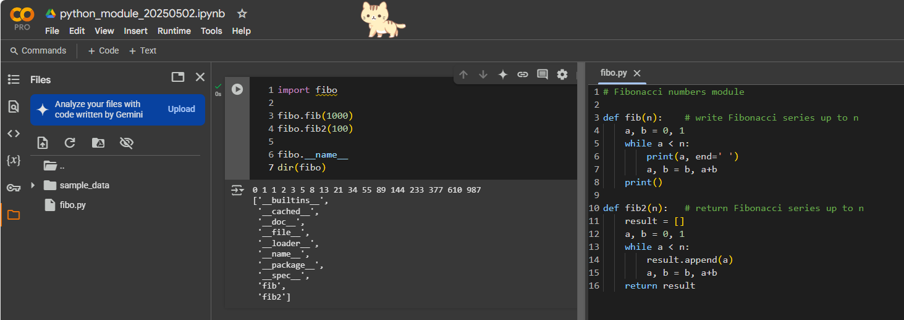

# OOP2: python module 模組開發
- https://www.pythontutorial.net/python-basics/python-module/
- https://docs.python.org/3/tutorial/modules.html

# 範例1:
#### A888168.py
```python
def greeting(name):
  print("Hello, " + name)
```
#### main.py
```python
import A888168

A888168.greeting("Jonathan")
```
# 範例2: 
#### fibo.py
```python
# Fibonacci numbers module

def fib(n):    # write Fibonacci series up to n
    a, b = 0, 1
    while a < n:
        print(a, end=' ')
        a, b = b, a+b
    print()

def fib2(n):   # return Fibonacci series up to n
    result = []
    a, b = 0, 1
    while a < n:
        result.append(a)
        a, b = b, a+b
    return result
```
#### main.py
```python
import fibo

fibo.fib(1000)
fibo.fib2(100)

fibo.__name__
dir(fibo)
```



 
