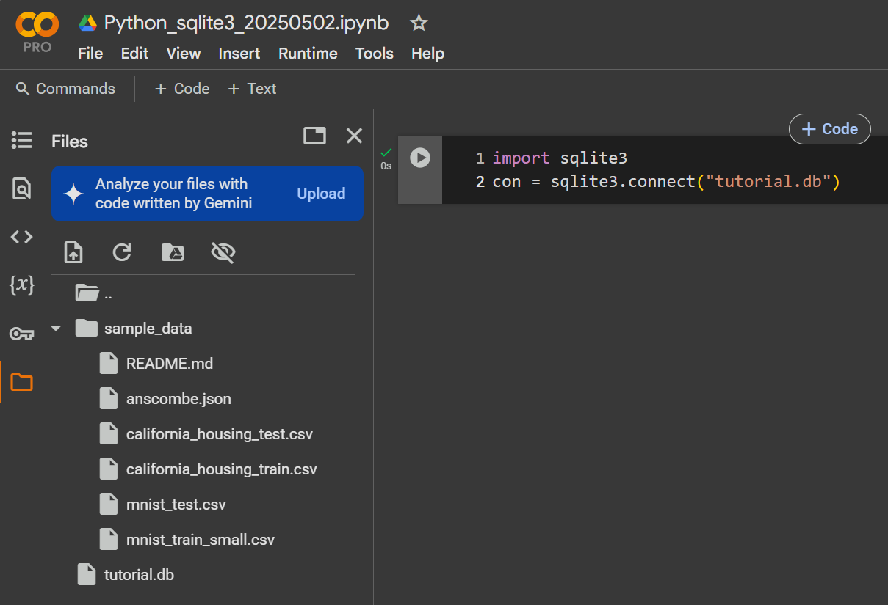

### Python內建模組|built-in modules in Python ==> 常用的
- https://www.w3schools.com/python/python_modules.asp
- https://docs.python.org/3/py-modindex.html
- abc ==>	Abstract base classes
- argparse ==>	Command-line option and argument parsing library
- asyncio ==>	Asynchronous I/O
- base64	 ==>RFC 4648: Base16, Base32, Base64 Data Encodings; Base85 and Ascii85
- binascii	 ==>Tools for converting between binary and various ASCII-encoded binary representations.
- collections	 ==>Container datatypes
- functools ==>	Higher-order functions and operations on callable objects.
- hashlib ==>	Secure hash and message digest algorithms.
- json	 ==>Encode and decode the JSON format.
- os	 ==>	Miscellaneous operating system interfaces.
- pathlib	 ==>	Object-oriented filesystem paths
- platform ==>		Retrieves as much platform identifying data as possible.
- re	Regular expression operations.
- sqlite3	A DB-API 2.0 implementation using SQLite 3.x.
- statistics	Mathematical statistics functions
- string	Common string operations.
- sys	Access system-specific parameters and functions.
- time	Time access and conversions.
- timeit	Measure the execution time of small code snippets.
- types	Names for built-in types.

### Python內建模組|built-in modules in Python ==> platform 模組
- platform ==>		Retrieves as much platform identifying data as possible.
```PYTHON
import platform

x = platform.system()
print(x)
```
### Python內建模組|　[sqlite3 — DB-API 2.0 interface for SQLite databases](https://docs.python.org/3/library/sqlite3.html)
- Python SQLite3 模組用來將 SQLite 資料庫與 Python 在一起。
- 它是一個標準化的 Python DBI API 2.0，為與 SQLite 資料庫交互提供了一個簡單易用的介面。
- 無需單獨安裝此模組==>它在 2.5x 版本之後隨 Python 一起提供
- https://www.sqlitetutorial.net/sqlite-python/
- https://www.geeksforgeeks.org/python-sqlite/

##### 範例練習: 創建一個Monty Python電影資料庫並使用基本功能
- 步驟1:建立一個新資料庫tutorial.db

```python
import sqlite3
con = sqlite3.connect("tutorial.db")
```



- 返回的物件表示與磁碟上資料庫的連接
- 當前工作目錄中的不存在此資料庫，則創立它

- 步驟2:執行 SQL 語句並從 SQL 查詢中獲取結果==>使用cursor()方法

```PYTHON
cur = con.cursor()
```

- 步驟2:建立一個資料表movie(有三個欄位:title,發佈年份(year)和評論分數(score)

```PYTHON
cur.execute("CREATE TABLE movie(title, year, score)")
```

- 步驟3:輸入基本資料
```PYTHON
cur.execute("""
    INSERT INTO movie VALUES
        ('Monty Python and the Holy Grail', 1975, 8.2),
        ('And Now for Something Completely Different', 1971, 7.5)
""")

con.commit()
```
- 步驟4:資料庫查詢
```PYTHON
res = cur.execute("SELECT score FROM movie")
res.fetchall()
```
- 延伸學習
  - https://www.w3schools.com/sql/ 
