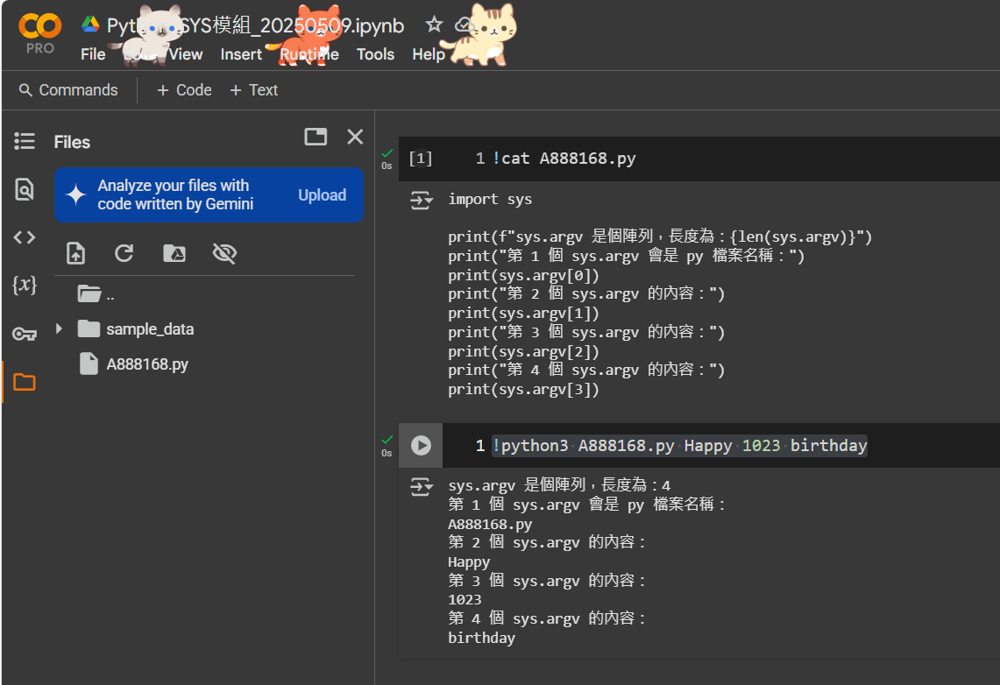
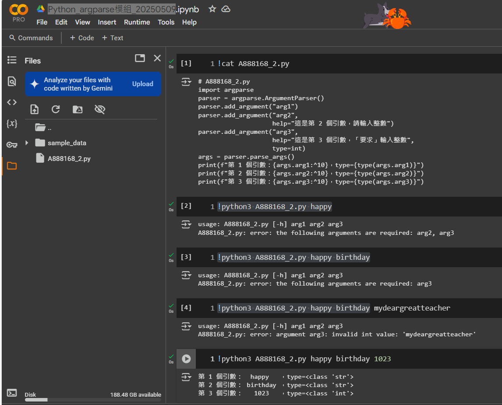

## 帶參數的程式執行
- !python3 A888168.py Happy 1023 birthday

## 使用sys模組
- sys 模組是 Python 的標準內建模組，提供了許多與 Python 解釋器相關的函式和變數。
- 通過 sys 模組，你可以訪問和操作 Python 解釋器的各種參數和配置，實現對程式的精細控制
- https://realnewbie.com/coding/python/python-sys-mpdule/
- https://docs.python.org/zh-tw/3/library/sys.html
- https://haosquare.com/python-argparse/
```python
import sys

print(f"sys.argv 是個陣列，長度為：{len(sys.argv)}")
print("第 1 個 sys.argv 會是 py 檔案名稱：")
print(sys.argv[0])
print("第 2 個 sys.argv 的內容：")
print(sys.argv[1])
print("第 3 個 sys.argv 的內容：")
print(sys.argv[2])
print("第 4 個 sys.argv 的內容：")
print(sys.argv[3])
```
- !python3 A888168.py Happy 1023 birthday



## 使用argparse模組
- https://haosquare.com/python-argparse/
- 使用argparse模組步驟:
  - 1.先使用argparse.ArgumentParser() 建立 物件 ==> 管理引數需要的 “parser”
  - 2.使用add_argument()方法  告訴 parser 我們需要的命令列引數有哪些
  - 3.使用 parse_args()方法 來從 parser 取得引數傳來的 Data

```python
# A888168_2.py
import argparse
parser = argparse.ArgumentParser()
parser.add_argument("arg1")
parser.add_argument("arg2",
                    help="這是第 2 個引數，請輸入整數")
parser.add_argument("arg3",
                    help="這是第 3 個引數，「要求」輸入整數",
                    type=int)
args = parser.parse_args()
print(f"第 1 個引數：{args.arg1:^10}，type={type(args.arg1)}")
print(f"第 2 個引數：{args.arg2:^10}，type={type(args.arg2)}")
print(f"第 3 個引數：{args.arg3:^10}，type={type(args.arg3)}")
```
- 執行底下錯誤的指令參數
  - !python3  A888168_2.py happy
  - !python3 A888168_2.py happy birthday
  - !python3 A888168_2.py happy birthday mydeargreatteacher
- 執行底下正確的指令參數
  - !python3 A888168_2.py happy birthday 1023


