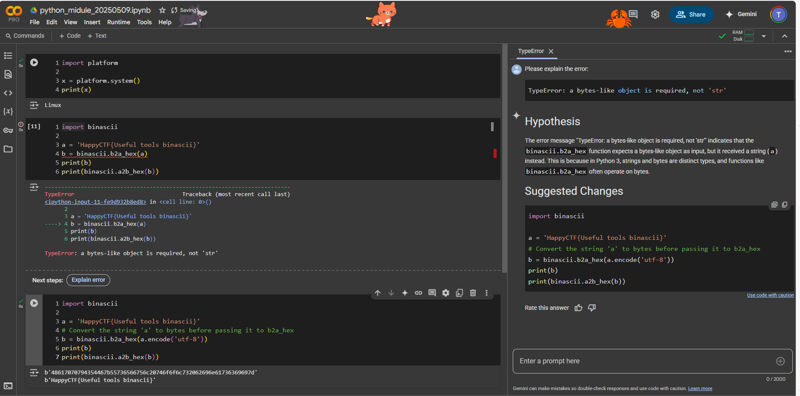

# python內建模組實作
- binascii ==> ascii編碼與解碼
- base64 模組編碼與解碼
## python內建模組 binascii
- [ASCII](https://zh.wikipedia.org/zh-tw/ASCII)
- 使用python內建模組 binascii
- https://docs.python.org/2/library/binascii.html
```python
#coding:utf-8
import binascii

a = 'HappyCTF{Useful tools binascii}'
b = binascii.b2a_hex(a)
print(b)
print(binascii.a2b_hex(b))
```



## base64模組 [Base64 - 維基百科](https://zh.wikipedia.org/zh-tw/Base64)
- [base64 — Base16, Base32, Base64, Base85 Data Encodings](https://docs.python.org/3/library/base64.html#module-base64)
- 原始碼 https://github.com/python/cpython/blob/3.13/Lib/base64.py
- 原始碼分析
  - def _bytes_from_decode_data(s)
  - def b64encode(s, altchars=None)
  - def b64decode(s, altchars=None, validate=False)
  - def standard_b64encode(s)
  - def standard_b64decode(s)
  - def urlsafe_b64encode(s)
  - def urlsafe_b64decode(s)
  - def _b32encode(alphabet, s)
  - def _b32decode(alphabet, s, casefold=False, map01=None)
  - def b32encode(s)
  - def b32decode(s, casefold=False, map01=None)
  - def b32hexencode(s)
  - def b32hexdecode(s, casefold=False)
  - def b16encode(s)
  - def b16decode(s, casefold=False)
  - ....族繁不及備載

```python
import base64

input_string = "U3Vubnk="
decoded_value = base64.b64decode(input_string).decode("utf-8")
print(decoded_value)
```
##### 使用Base 64 模組編碼:b64encode()
```python
import base64

data =b'BreakAllCTF{HappyPythonDay}'
encoded_data = base64.b64encode(data)
print('Original Data :', data)
print('Encoded :', encoded_data)
```python
##### 使用Base 64 模組解碼:b64decode()
```python
import base64

encoded_data = b'QnJlYWtBTExDVEZ7NTN1c1pRM2hXVzI1ZGNoWjdkWGV9'
decoded_data = base64.b64decode(encoded_data)
print('Encoded :', encoded_data)
print('Decoded :', decoded_data)
```
##### 使用Base 64 模組也可以進行Base 32編碼與解碼
```python
import base64

original_data = b'BreakAllCTF{HappyPythonDay}'
print('Original data:', original_data)

encoded_data = base64.b32encode(original_data)
print('Encoded :', encoded_data)

decoded_data = base64.b32decode(encoded_data)
print('Decoded :', decoded_data)
```

#### ASCII
```
編碼與解碼是資訊領域日常都在使用的技術，如Ascii、Base64、Base32各有其適用處。
ASCII(American Standard Code for Information Interchange)美國資訊交換標準代碼是基於拉丁字母的一套電腦編碼系統，
它是現今最通用的單字元編碼系統。

請問你對Ascii編碼與解碼的技術了解嗎?
你知道如何解碼下列資料嗎:
66 114 101 97 107 65 76 76 67 84 70 123 65 109 118 48 117 68 121 101 114 118 80 116 109 86 114 57 83 83 83 75 125

看看維基百科的說明,來自我學習一下:
https://zh.wikipedia.org/wiki/ASCII

善用網路線上資源
試著用Google查察 ascii decoder
```
#### Base64
```
編碼與解碼是資訊領域日常都在使用的技術，如Ascii、Base64、Base32各有其適用處，
請問你對Base64編碼與解碼的技術了解嗎?

你知道如何解碼下列資料嗎:

QnJlYWtBTExDVEZ7NTN1c1pRM2hXVzI1ZGNoWjdkWGV9
```

#### Base32
```
編碼與解碼是資訊領域日常都在使用的技術，Base32是由使用26個字母A-Z和數字0-9的編碼。

請問你對Base32編碼與解碼的技術了解嗎?

你知道如何解碼下列資料嗎:

IJZGKYLLIFGEYQ2UIZ5TS6BUHA2VMUZXO5UWS5CCLJMFKVLIJVSX2===
```
- 進階解法 ==> 請用python base64模組解題
