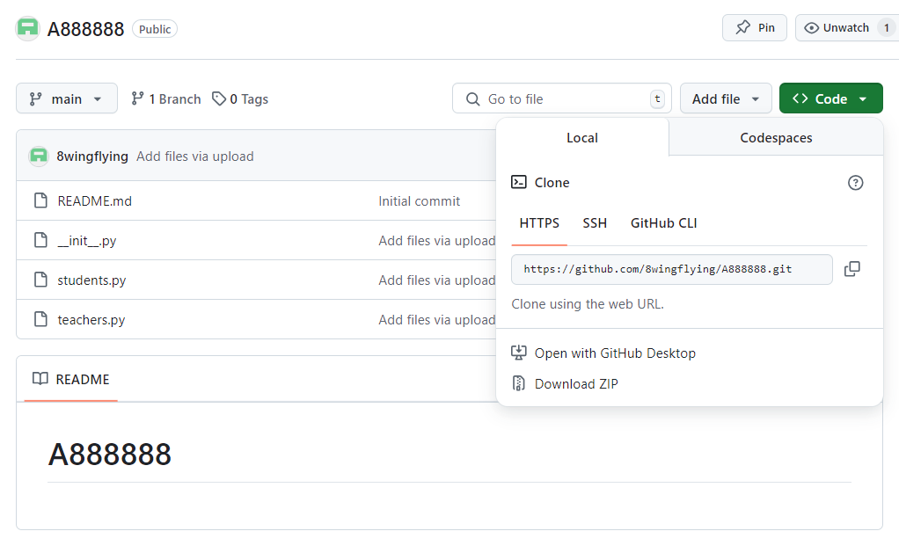

# Packages(套件)
- 建立自己的套件

# Packages(套件)實作
- 範例使用https://pythongeeks.org/python-packages/
- 步驟1:建立底下程式並上傳到github
  - 建立一個目錄 A888168(請用你的學號)
  - /A888168
    - 第一支程式: `__init__.py`
    - 第二支程式: students.py
    - 第三支程式: teachers.py
  - 在你的github上建立A888168(請用你的學號) ==>並把上述程式上傳到github

- 在Google Colab上執行 !git clone .....
- 在Google Colab撰寫程式==> 請參考底下照片

